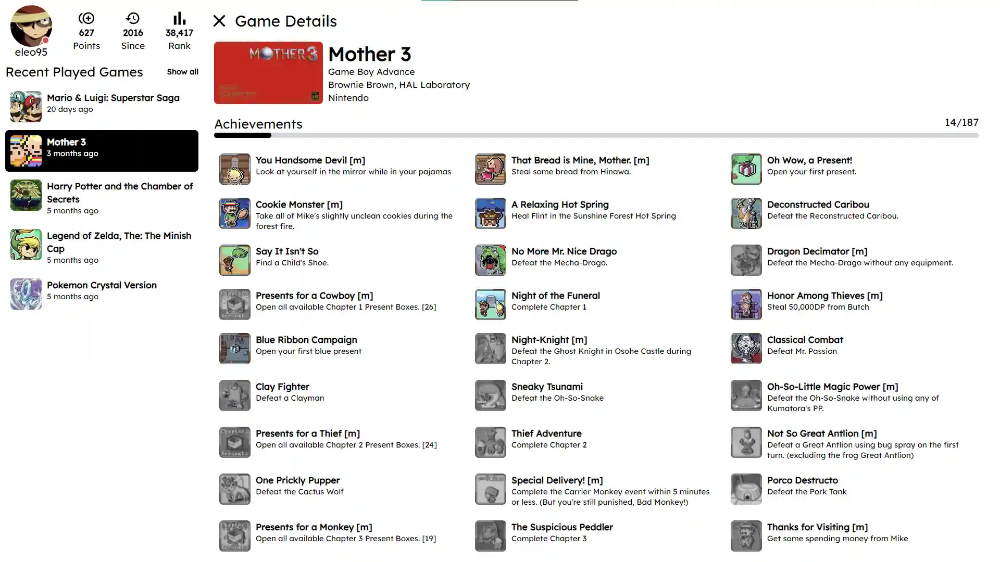

# Troph

A personal web client for retroachievements.org

Authentication to the [RetroAchievements](retroachievements.org) site must be done in order to be able to use this client.

If you already have an account or have done the above step you need to authenticate:


## Setup 
* Obtain your *username* and *API key* from your [RetroAchievements](retroachievements.org) account.
* Your API key and Username must be added as environment variables like this: 

    ```
    VITE_RA_USER=exampleUser        // username from retroachivements.org
    VITE_RA_API_KEY=eXaMpLeApIKeY   // api key from retroachivements.org profile page
    ```

* Clone this project 
* Run yarn install then yarn dev


## About

Built with:

* Typescript
* Reactjs
* Vite
* TailwindCSS
* React-Query

## Screenshots



